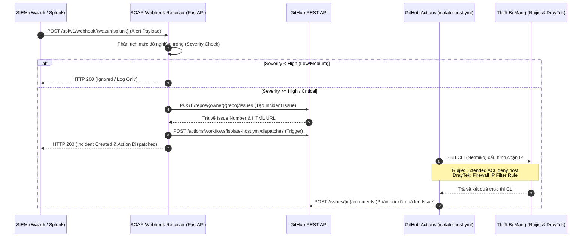

# 🛡️ SOAR Webhook Receiver & GitHub Incident Automation (Ruijie & DrayTek)

Hệ thống **SOAR** (Security Orchestration, Automation, and Response) tự động hóa quy trình xử lý sự cố an ninh mạng kết hợp giữa **SIEM (Wazuh / Splunk)**, **GitHub API / Actions**, và thiết bị mạng phần cứng (**Ruijie Switch/Gateway** & **DrayTek Vigor Router**).

---

## 📌 Luồng Hoạt Động (Incident Workflow)



---

## 📂 Cấu Trúc Thư Mục

```text
soar_integration/
├── app.py                      # Ứng dụng Webhook FastAPI chính
├── config.py                   # Quản lý cài đặt & nạp biến môi trường
├── github_client.py            # Client tương tác GitHub REST API (Issues, Workflows, Comments)
├── network_isolation.py        # Kịch bản SSH Netmiko cấu hình Ruijie & DrayTek
├── simulate_alert.py           # Kịch bản giả lập gửi cảnh báo kiểm thử
├── requirements.txt            # Danh sách thư viện Python
├── .env.example                # Mẫu biến môi trường
├── .env                        # File biến môi trường thực tế (bảo mật)
├── .github/
│   └── workflows/
│       └── isolate-host.yml    # Workflow mẫu chạy trên GitHub Actions
└── README.md                   # Tài liệu hướng dẫn vận hành
```

---

## ⚙️ 1. Cài Đặt Môi Trường & Thư Viện

Yêu cầu: Python 3.10 trở lên.

```bash
# Di chuyển vào thư mục dự án
cd soar_integration

# Cài đặt các gói phụ thuộc
pip install -r requirements.txt
```

---

## 🔑 2. Cấu Hình Biến Môi Trường (`.env`)

Sao chép file mẫu:
```bash
cp .env.example .env
```

Điền các thông số tương ứng trong `.env`:
* **GitHub Settings**:
  * `GITHUB_TOKEN`: Personal Access Token có quyền `repo` và `workflow`.
  * `GITHUB_REPOSITORY`: Repository lưu trữ incident (ví dụ: `leha-8/Data`).
  * `GITHUB_SOC_ASSIGNEES`: Danh sách tài khoản SOC (ví dụ: `leha-8`).
* **Ruijie Settings**:
  * `RUIJIE_HOST`: Địa chỉ IP Switch/Gateway Ruijie.
  * `RUIJIE_USERNAME`, `RUIJIE_PASSWORD`, `RUIJIE_SECRET`.
  * `RUIJIE_ACL_NAME`: Tên Access-List mở rộng (mặc định: `ACL_SOAR_BLOCK`).
  * `RUIJIE_VLAN_INTERFACE`: Interface áp dụng ACL (mặc định: `GigabitEthernet 0/1`).
* **DrayTek Settings**:
  * `DRAYTEK_HOST`: Địa chỉ IP Router DrayTek Vigor.
  * `DRAYTEK_USERNAME`, `DRAYTEK_PASSWORD`, `DRAYTEK_SSH_PORT`.
  * `DRAYTEK_FILTER_SET`, `DRAYTEK_FILTER_RULE`: Vị trí Rule trong Firewall Data Filter.
* **Testing Settings**:
  * `DRY_RUN=true`: Đặt là `true` khi muốn kiểm thử mô phỏng (không gửi lệnh ghi vào phần cứng thật).

---

## 🚀 3. Khởi Chạy Webhook Receiver

Khởi động dịch vụ với Uvicorn:

```bash
uvicorn app:app --host 0.0.0.0 --port 8000 --reload
```

* **Swagger UI / OpenAPI Documentation**: Truy cập trình duyệt tại `http://localhost:8000/docs`
* **Kiểm tra trạng thái (Health Check)**: `http://localhost:8000/healthz`

---

## 📡 4. Tích Hợp Webhook Vào SIEM

### Cấu hình Wazuh Manager (`ossec.conf`)
Thêm cấu hình integration vào `/var/ossec/etc/ossec.conf`:

```xml
<integration>
  <name>custom-soar</name>
  <hook_url>http://<SOAR_IP>:8000/api/v1/webhook/wazuh</hook_url>
  <level>7</level>
  <alert_format>json</alert_format>
</integration>
```

### Cấu hình Splunk Alert Action
1. Vào **Settings** > **Searches, reports, and alerts** > Chọn Alert cần gửi.
2. Tại mục **Trigger Actions** > Chọn **Add Actions** > **Webhook**.
3. Điền URL: `http://<SOAR_IP>:8000/api/v1/webhook/splunk`.

---

## 🖥️ 5. Chi Tiết Lệnh CLI Trên Thiết Bị Mạng

### A. Ruijie Switch/Gateway (RGOS)
Kịch bản SSH vào Ruijie (`device_type="ruijie_os"`) và thực thi chuỗi lệnh:

```text
enable
configure terminal
ip access-list extended ACL_SOAR_BLOCK
  deny ip host <IP_NHIỄM> any
  permit ip any any
  exit
interface GigabitEthernet 0/1
  ip access-group ACL_SOAR_BLOCK in
  exit
write memory
```

### B. DrayTek Vigor Router (VigorOS)
Kịch bản SSH vào DrayTek (`device_type="draytek_vigor"`) và thêm Rule chặn IP:

```text
ip filter 2 2 enable
ip filter 2 2 name SOAR_BLOCK_<IP>
ip filter 2 2 action block
ip filter 2 2 dir in
ip filter 2 2 srcip <IP_NHIỄM>
ip filter 2 2 dstip any
sys commit
```

---

## 🧪 6. Hướng Dẫn Kiểm Thử (Testing)

### Cách 1: Chạy trực tiếp kịch bản cô lập CLI (Standalone / Dry-run)
```bash
# Kiểm thử mô phỏng dòng lệnh chặn IP cho cả 2 thiết bị
python network_isolation.py --ip 192.168.10.150 --target all --dry-run

# Gỡ bỏ IP khỏi danh sách chặn (Unblock) sau khi xử lý xong
python network_isolation.py --ip 192.168.10.150 --target ruijie --unblock --dry-run
```

### Cách 2: Chạy giả lập gửi cảnh báo từ SIEM
Trong một cửa sổ terminal khác, chạy:
```bash
# Giả lập cảnh báo Wazuh Critical (Rule Level 14) & Splunk High
python simulate_alert.py --url http://127.0.0.1:8000 --type all
```

---

## 🔒 7. Bảo Mật & Lưu Ý Môi Trường On-Premise

1. **GitHub Secrets**:
   Khi đưa workflow `.github/workflows/isolate-host.yml` lên GitHub, hãy khai báo các thông tin đăng nhập trong **Settings** > **Secrets and variables** > **Actions**:
   - `RUIJIE_HOST`, `RUIJIE_USERNAME`, `RUIJIE_PASSWORD`, `RUIJIE_SECRET`
   - `DRAYTEK_HOST`, `DRAYTEK_USERNAME`, `DRAYTEK_PASSWORD`

2. **Self-hosted Runner cho mạng On-Premise**:
   - Nếu Router/Switch nằm trong mạng nội bộ không mở port SSH ra Internet (khuyến nghị vì lý do an ninh), bạn hãy cài đặt **GitHub Actions Self-hosted Runner** trên một máy chủ nội bộ.
   - Sau đó đổi cấu hình trong file `isolate-host.yml`:
     ```yaml
     runs-on: self-hosted
     ```
   - Khi đó, runner sẽ thực thi kịch bản SSH trực tiếp từ mạng LAN nội bộ an toàn 100%.
